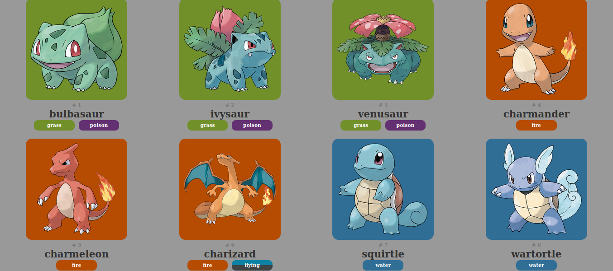
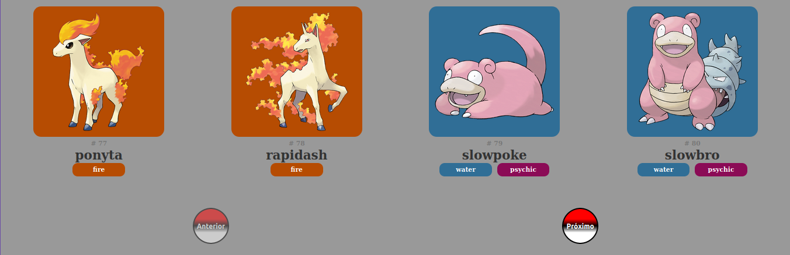

#  Pokedex






<br/>

# :page_with_curl: Índice:


- [Sobre](#-Sobre)
- [Tecnologias utilizadas](#-Tecnologias-utilizadas)
- [Conceitos estudados](#-Conceitos-estudados)


<br/>

# :book: Sobre

Projeto **desenvolvido por mim**, para exercitar meus conhecimentos em **ReactJS** e CSS.

Utilizei a API do [pokeapi](https://pokeapi.co/) para receber as informações necessárias e me inspirei no design da [pokedex](https://www.pokemon.com/us/pokedex/) para a criação da página.

Ainda existem Features à serem implantadas. Pretendo fazer isso com o tempo.

---

# :computer: Tecnologias utilizadas

- [ReactJS](https://reactjs.org/)
- [Yarn](https://yarnpkg.com/getting-started/install)
- [create-react-app](https://create-react-app.dev/docs/getting-started/)

---

<br/>

# :notebook_with_decorative_cover: Conceitos estudados

- Async/Await
- UseState/UseEffect
- Componentização
- Gerenciamento de rotas (á ser implantado)
- Design responsivo (á ser implantado)

---

<br/>

# :card_file_box: Como baixar o projeto

```js

// clonar o repositório

    $ git clone https://github.com/P-L-T-S/pokedex.git

// instalar as dependencias

    $ yarn install

// iniciar o projetos

    $ yarn start

```

<br/>

---

<br/>
<br/>

# :telephone: Contatos

<br/>

<div align="center">
    <a href="mailto:pedrolts16@gmail.com">
        
    </a>
    <a href="https://www.linkedin.com/in/pedro-teixeira-dev/">
        
    </a>
    <a href="https://www.instagram.com/pedrolts16/">
        
    </a>

<br/>

<br/>


### Feito com :heart: por [Pedro Leonardo](https://www.linkedin.com/in/pedro-teixeira-dev/)

</div>

